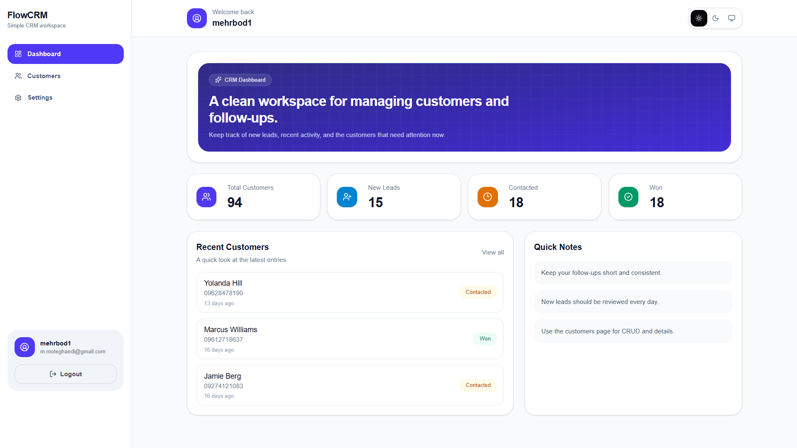
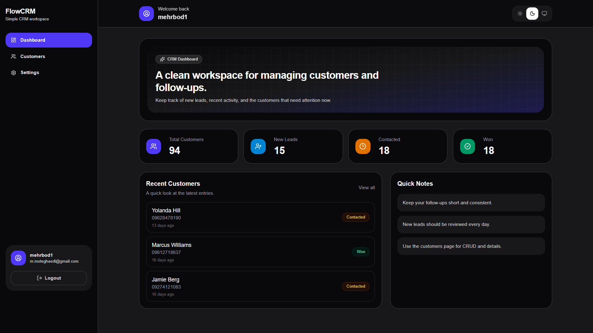
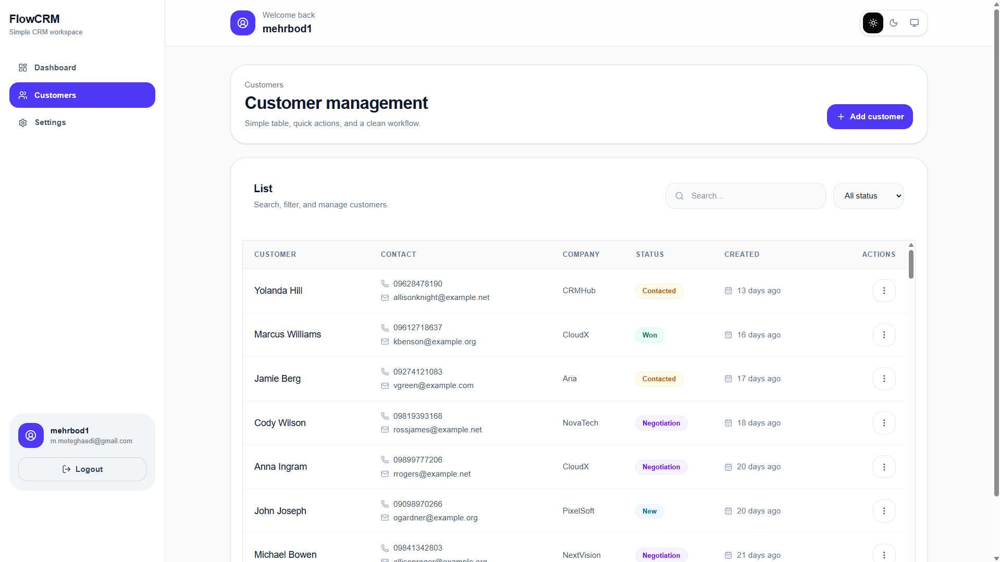

# 🚀 CRM Dashboard

A modern and responsive CRM Dashboard built with **Next.js 16**, **React 19**, **TypeScript**, and **MongoDB**.
The project focuses on clean architecture, reusable components, scalable code structure, and a modern user experience.

---

## 📸 Screenshots

### Dashboard (Light)



---

### Dashboard (Dark)



---

### Customers



---

# ✨ Features

### Authentication

- JWT Authentication
- Secure HTTP Cookies
- Protected Routes
- Automatic Redirect
- Logout

---

### Dashboard

- Statistics Cards
- Recent Customers
- Responsive Layout
- Loading Skeletons

---

### Customer Management

- Create Customer
- Edit Customer
- Delete Customer
- Customer Details
- Status Badges
- Dropdown Actions
- Confirmation Modal

---

### Settings

- Update Profile
- Theme Switcher
- Dark / Light / System Mode
- Logout

---

### User Experience

- Responsive Design
- Loading States
- Skeleton Screens
- Toast Notifications
- Clean Animations

---

# 🛠 Tech Stack

### Frontend

- Next.js 16 (App Router)
- React 19
- TypeScript
- Tailwind CSS
- React Hook Form
- TanStack React Query
- Axios
- Lucide React
- next-themes

### Backend

- Next.js Route Handlers
- MongoDB
- Mongoose
- JWT Authentication

---

# 📁 Folder Structure

```text
src
│
├── app
│   ├── api
│   ├── dashboard
│   ├── customers
│   ├── settings
│   └── auth
│
├── components
│
├── features
│   ├── auth
│   ├── customers
│   ├── dashboard
│   └── settings
│
│
├── lib
│
├── models
│
└── providers
```

---

# ⚙️ Getting Started

Clone the repository

```bash
git clone https://github.com/mehrbod1384/crm-dashboard.git
```

Install dependencies

```bash
npm install
```

Run development server

```bash
npm run dev
```

Open

```text
http://localhost:3000
```

---

# 🔐 Environment Variables

Create a `.env.local` file.

```env
DATABASE=

JWT_SECRET=

APP_URL=http://localhost:3000
```

---

# 📡 API Routes

## Authentication

```text
POST /api/auth/register
POST /api/auth/login
POST /api/auth/logout
```

---

## Profile

```text
GET    /api/auth/profile
PATCH  /api/auth/profile
```

---

## Customers

```text
GET    /api/customers
POST   /api/customers
PATCH  /api/customers/:id
DELETE /api/customers/:id
```

---

# 🎨 UI Highlights

- Modern SaaS Design
- Minimal Interface
- Reusable Components
- Responsive Layout
- Dark Mode
- Clean Typography
- Smooth Loading Experience

---

# 🚀 Future Improvements

- Pagination
- Search
- Filtering
- Sorting
- Customer Notes
- Customer Timeline
- Deals Pipeline
- Tasks
- Calendar
- Charts & Analytics
- Team Management
- Role-Based Access Control

---

# 📈 Performance

- React Query Caching
- Axios API Layer
- Modular Architecture
- Reusable Hooks
- Component-Based Design
- Optimized Rendering

---

# 👨‍💻 Author

**Mehrbod Moteghaedi**

---
